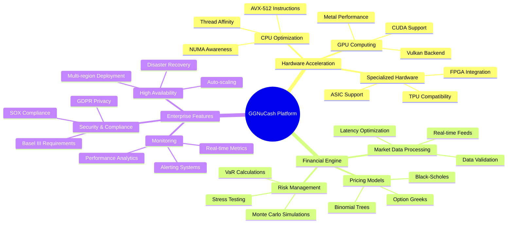
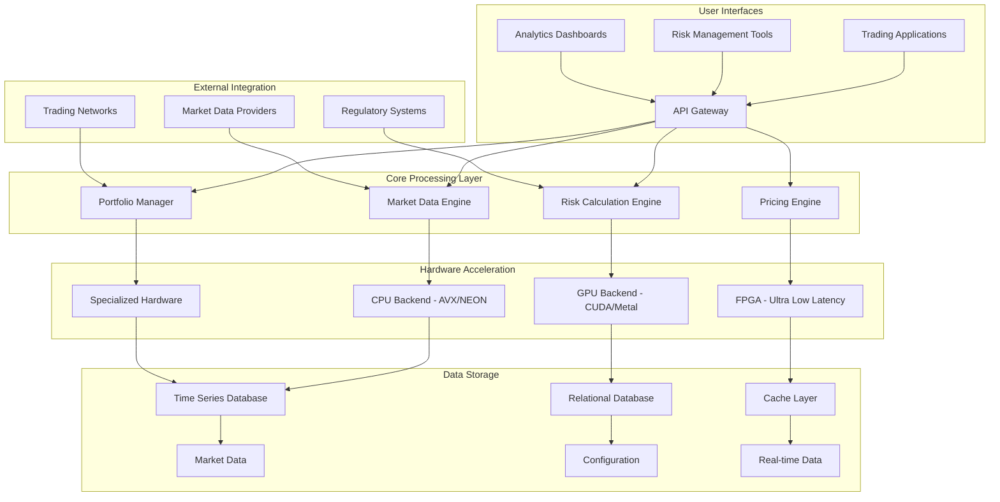
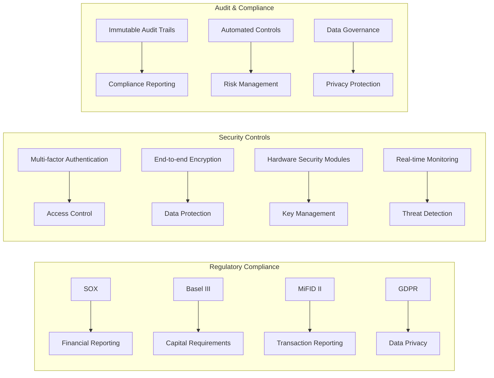
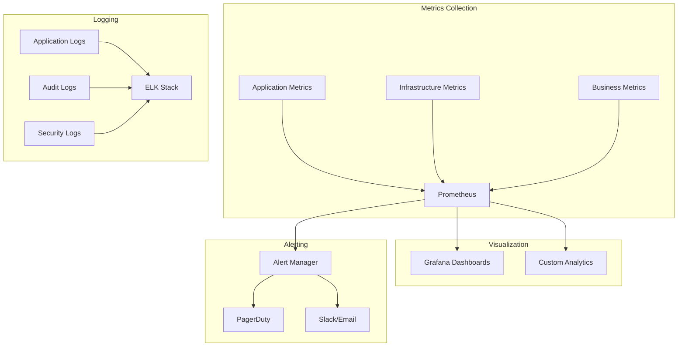

# GGNuCash Financial Hardware Platform - Documentation Index

## Welcome to GGNuCash Documentation

GGNuCash is a high-performance financial computation platform built on the GGML tensor library infrastructure, designed for hardware-accelerated financial modeling, risk analysis, and real-time transaction processing.

## 📚 Complete Documentation Suite

### 🏗️ Architecture and Design
- **[Technical Architecture](./ggnucash-architecture.md)** - Comprehensive overview of system architecture with mermaid diagrams
- **[Financial Hardware Implementation](./financial-hardware-implementation.md)** - Detailed hardware optimization and platform support
- **[System Components and API](./system-components-api.md)** - Component architecture and API reference

### 🚀 Deployment and Operations  
- **[Deployment and Scaling Guide](./deployment-scaling.md)** - Production deployment strategies and scaling approaches
- **[Security and Compliance](./security-compliance.md)** - Security framework and regulatory compliance

### 📋 Quick Reference
- **[Build Instructions](./build.md)** - How to build and compile the system
- **[Installation Guide](./install.md)** - Installation procedures for different platforms
- **[Docker Deployment](./docker.md)** - Containerized deployment options

## 🎯 Key Features Overview



## 🏛️ System Architecture at a Glance



## 🔧 Hardware Support Matrix

| Hardware Type | Status | Performance | Use Cases |
|---------------|--------|-------------|-----------|
| **Intel x86-64** | ✅ Full Support | Excellent | General purpose, development |
| **AMD EPYC** | ✅ Full Support | Excellent | High core count workloads |
| **Apple Silicon (M1/M2/M3)** | ✅ Optimized | Excellent | Development, edge computing |
| **NVIDIA GPUs** | ✅ CUDA Accelerated | Outstanding | Risk calculations, ML models |
| **AMD GPUs** | ✅ ROCm Support | Very Good | Cost-effective GPU computing |
| **Intel GPUs** | ✅ SYCL/OneAPI | Good | Cross-platform compatibility |
| **FPGAs** | 🔄 In Development | Ultra-fast | Ultra-low latency trading |
| **ASICs** | 📋 Planned | Custom | Specialized financial operations |

## ⚡ Performance Characteristics

### Latency Targets
- **Market data ingestion**: < 10μs
- **Risk calculation**: < 50μs  
- **Portfolio rebalancing**: < 100μs
- **Options pricing**: < 25μs per instrument

### Throughput Capabilities
- **Order processing**: 1M+ orders/second
- **Market data updates**: 10M+ ticks/second
- **Risk calculations**: 100K+ scenarios/second
- **Historical analysis**: 10+ years of data in minutes

## 🔐 Security and Compliance Features



## 🛠️ Getting Started

### Quick Start Guide

1. **System Requirements Check**
   ```bash
   # Verify hardware compatibility
   cmake -B build
   cmake --build build --target hardware-check
   ```

2. **Basic Installation**
   ```bash
   # Clone and build
   git clone https://github.com/rzonedevops/ggnumlcash.cpp
   cd ggnumlcash.cpp
   cmake -B build -DGGML_CUDA=ON  # Enable GPU acceleration
   cmake --build build --config Release -j $(nproc)
   ```

3. **Configuration Setup**
   ```bash
   # Copy sample configuration
   cp config/ggnucash-sample.yaml config/ggnucash.yaml
   # Edit configuration for your environment
   vim config/ggnucash.yaml
   ```

4. **Run Tests**
   ```bash
   # Verify installation
   ctest --test-dir build --output-on-failure
   ```

5. **Start Services**
   ```bash
   # Launch the main server
   ./build/bin/ggnucash-server --config config/ggnucash.yaml
   ```

### Development Environment Setup

For detailed development setup instructions, see:
- [Development Environment Guide](./development/setup.md)
- [Contributing Guidelines](../CONTRIBUTING.md)
- [Code Style Guide](./development/coding-standards.md)

## 📊 Use Cases and Applications

### High-Frequency Trading
- Ultra-low latency order processing
- Real-time market data analysis
- Algorithmic trading strategies
- Risk management integration

### Risk Management
- Portfolio risk calculations
- Stress testing scenarios
- Regulatory capital requirements
- Real-time exposure monitoring

### Quantitative Analysis
- Mathematical model implementation
- Statistical analysis tools
- Machine learning integration
- Backtesting frameworks

### Regulatory Reporting
- Automated compliance reporting
- Audit trail generation
- Data governance controls
- Privacy protection measures

## 🌐 Deployment Options

### Cloud Platforms
- **AWS**: Optimized AMIs with GPU support
- **Azure**: Azure Machine Learning integration
- **Google Cloud**: TPU acceleration available
- **Kubernetes**: Full container orchestration

### On-Premises
- **Bare Metal**: Maximum performance configuration
- **Private Cloud**: VMware/OpenStack integration
- **Hybrid**: Cloud-edge deployment models

### Edge Computing
- **Trading Floor**: Co-location with exchanges
- **Branch Offices**: Regional processing nodes
- **Mobile**: Tablet/laptop deployment

## 📈 Monitoring and Observability



## 🤝 Community and Support

### Documentation Updates
This documentation is actively maintained and updated. Key areas of focus:

- **Regular Updates**: Architecture evolves with new hardware support
- **Community Contributions**: Pull requests welcome for improvements
- **Example Galleries**: Real-world usage examples and case studies
- **Performance Benchmarks**: Updated performance data across hardware platforms

### Getting Help
- **GitHub Issues**: Report bugs and request features
- **Discussions**: Architecture questions and implementation guidance
- **Security Issues**: Responsible disclosure process in [SECURITY.md](../SECURITY.md)

### Contributing
- **Code Contributions**: See [CONTRIBUTING.md](../CONTRIBUTING.md)
- **Documentation**: Help improve and expand documentation
- **Testing**: Add test cases and performance benchmarks
- **Hardware Support**: Contribute platform-specific optimizations

## 📚 Additional Resources

### Technical Deep Dives
- [GGML Tensor Operations](./technical/ggml-integration.md)
- [Financial Algorithm Implementation](./technical/financial-algorithms.md)
- [Hardware Optimization Techniques](./technical/hardware-optimization.md)
- [Performance Tuning Guide](./technical/performance-tuning.md)

### Industry Standards and References
- [Financial Industry Standards](./references/industry-standards.md)
- [Regulatory Requirements](./references/regulatory-compliance.md)
- [Hardware Architecture Guides](./references/hardware-architecture.md)
- [Security Best Practices](./references/security-practices.md)

## 🔄 Document Version History

| Version | Date | Changes |
|---------|------|---------|
| 1.0.0 | 2024-01-15 | Initial comprehensive documentation release |
| 1.0.1 | 2024-01-16 | Added hardware optimization details |
| 1.0.2 | 2024-01-17 | Enhanced security and compliance sections |

---

*This documentation represents the complete technical architecture and implementation guide for the GGNuCash financial hardware platform. For the latest updates and additional resources, please visit the [project repository](https://github.com/rzonedevops/ggnumlcash.cpp).*