# GGNuCash Deployment and Scaling Guide

## Overview

This guide provides comprehensive instructions for deploying GGNuCash in production environments with considerations for high availability, scalability, and performance optimization for financial applications.

## Deployment Architectures

### Single-Node Development Setup

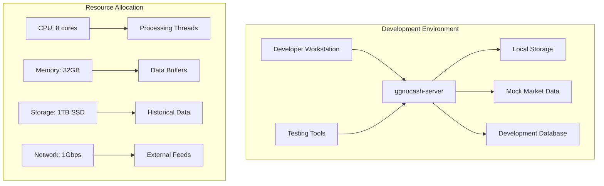

**Development Configuration:**
```yaml
# dev-config.yaml
deployment:
  mode: "development"
  replicas: 1
  
resources:
  cpu:
    cores: 8
    threads_per_core: 2
  memory:
    total: "32GB"
    buffer_pool: "16GB"
  storage:
    type: "local_ssd"
    capacity: "1TB"
    
market_data:
  mode: "simulation"
  replay_speed: 1.0
  historical_data: true
```

### Production High-Availability Setup

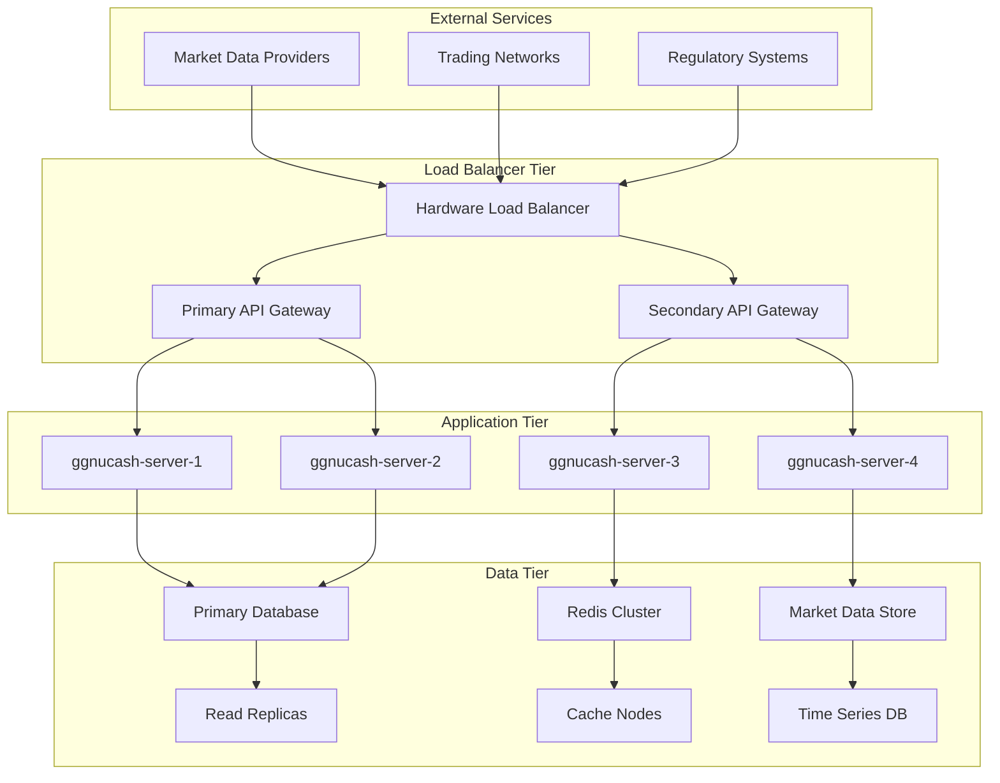

### Cloud-Native Kubernetes Deployment

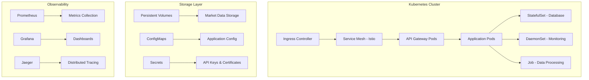

**Kubernetes Manifests:**

```yaml
# ggnucash-deployment.yaml
apiVersion: apps/v1
kind: Deployment
metadata:
  name: ggnucash-server
  namespace: financial
spec:
  replicas: 4
  selector:
    matchLabels:
      app: ggnucash-server
  template:
    metadata:
      labels:
        app: ggnucash-server
    spec:
      nodeSelector:
        ggnucash.io/hardware-profile: "high-performance"
      containers:
      - name: ggnucash-server
        image: ggnucash/server:v1.2.0
        resources:
          requests:
            cpu: "4"
            memory: "16Gi"
            nvidia.com/gpu: "1"
          limits:
            cpu: "8"
            memory: "32Gi"
            nvidia.com/gpu: "1"
        env:
        - name: GGML_CUDA
          value: "1"
        - name: NUMA_AWARE
          value: "true"
        ports:
        - containerPort: 8080
          name: http-api
        - containerPort: 8443
          name: https-api
        - containerPort: 9090
          name: metrics
        volumeMounts:
        - name: market-data-cache
          mountPath: /var/cache/market-data
        - name: config
          mountPath: /etc/ggnucash
        - name: gpu-driver
          mountPath: /usr/local/cuda
      volumes:
      - name: market-data-cache
        persistentVolumeClaim:
          claimName: market-data-pvc
      - name: config
        configMap:
          name: ggnucash-config
      - name: gpu-driver
        hostPath:
          path: /usr/local/cuda
---
apiVersion: v1
kind: Service
metadata:
  name: ggnucash-service
  namespace: financial
spec:
  selector:
    app: ggnucash-server
  ports:
  - name: http
    port: 80
    targetPort: 8080
  - name: https
    port: 443
    targetPort: 8443
  type: ClusterIP
```

### Edge Computing Deployment

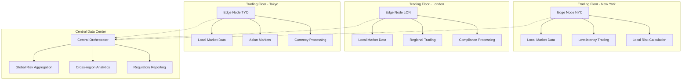

## Scaling Strategies

### Horizontal Scaling

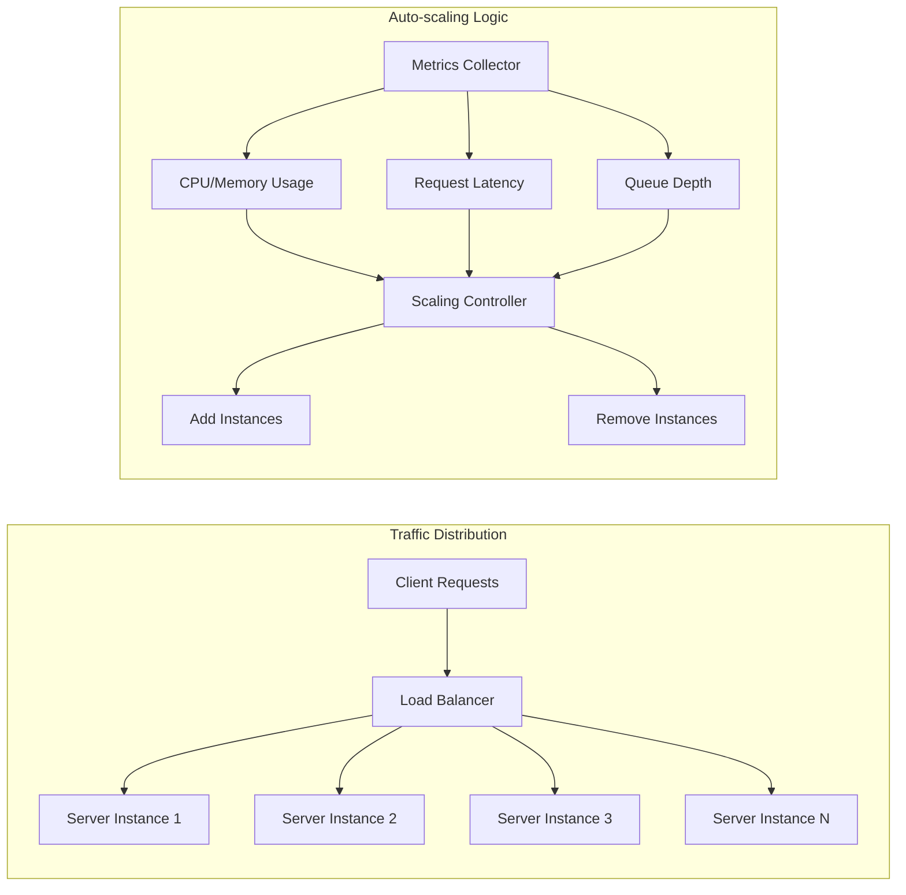

**Auto-scaling Configuration:**
```yaml
# horizontal-pod-autoscaler.yaml
apiVersion: autoscaling/v2
kind: HorizontalPodAutoscaler
metadata:
  name: ggnucash-hpa
  namespace: financial
spec:
  scaleTargetRef:
    apiVersion: apps/v1
    kind: Deployment
    name: ggnucash-server
  minReplicas: 2
  maxReplicas: 20
  metrics:
  - type: Resource
    resource:
      name: cpu
      target:
        type: Utilization
        averageUtilization: 70
  - type: Resource
    resource:
      name: memory
      target:
        type: Utilization
        averageUtilization: 80
  - type: Pods
    pods:
      metric:
        name: request_latency_p99
      target:
        type: AverageValue
        averageValue: "10m"  # 10 milliseconds
  behavior:
    scaleUp:
      stabilizationWindowSeconds: 30
      policies:
      - type: Percent
        value: 50
        periodSeconds: 30
    scaleDown:
      stabilizationWindowSeconds: 300
      policies:
      - type: Percent
        value: 25
        periodSeconds: 60
```

### Vertical Scaling

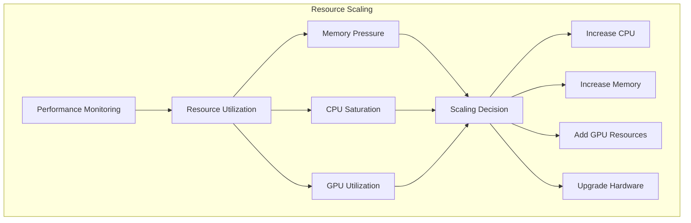

**Vertical Pod Autoscaler Configuration:**
```yaml
# vertical-pod-autoscaler.yaml
apiVersion: autoscaling.k8s.io/v1
kind: VerticalPodAutoscaler
metadata:
  name: ggnucash-vpa
  namespace: financial
spec:
  targetRef:
    apiVersion: apps/v1
    kind: Deployment
    name: ggnucash-server
  updatePolicy:
    updateMode: "Auto"
  resourcePolicy:
    containerPolicies:
    - containerName: ggnucash-server
      minAllowed:
        cpu: "2"
        memory: "8Gi"
      maxAllowed:
        cpu: "16"
        memory: "64Gi"
      controlledResources: ["cpu", "memory"]
```

### Database Scaling

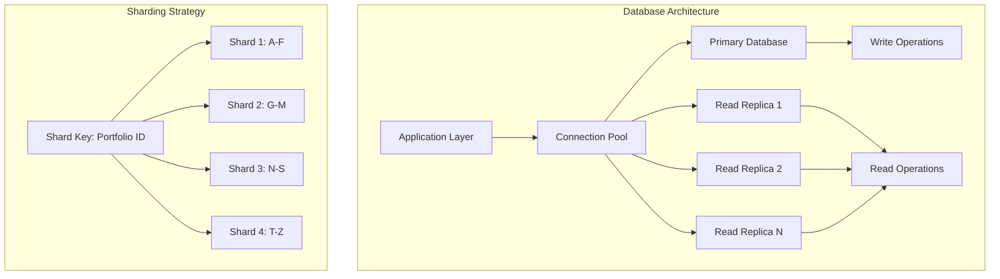

## Performance Optimization

### Cache Strategy

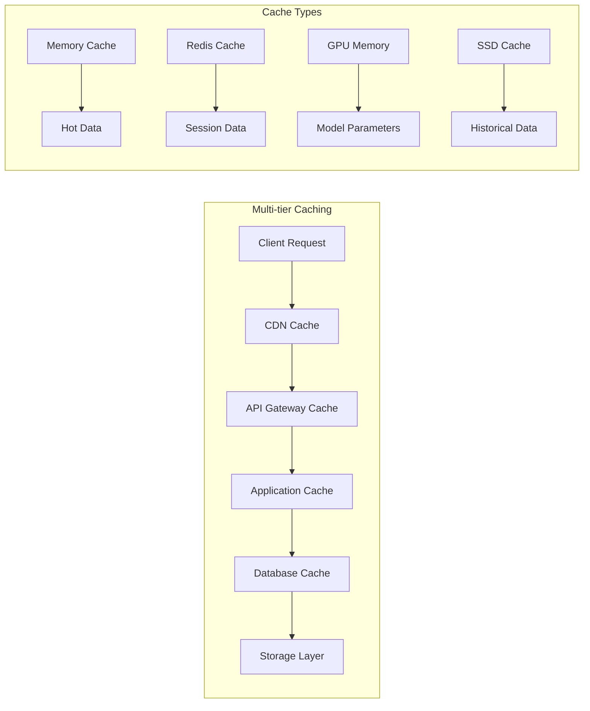

**Cache Configuration:**
```yaml
# cache-config.yaml
cache:
  levels:
    l1_memory:
      type: "in_memory"
      size: "4GB"
      ttl: "30s"
      policy: "lru"
      
    l2_redis:
      type: "redis_cluster"
      nodes: ["redis-1:6379", "redis-2:6379", "redis-3:6379"]
      size: "16GB"
      ttl: "5m"
      
    l3_ssd:
      type: "persistent"
      path: "/var/cache/ggnucash"
      size: "100GB"
      ttl: "1h"
      
  strategies:
    market_data:
      cache_level: ["l1_memory", "l2_redis"]
      refresh_interval: "1s"
      
    risk_calculations:
      cache_level: ["l1_memory", "l3_ssd"]
      refresh_interval: "30s"
      
    historical_data:
      cache_level: ["l3_ssd"]
      refresh_interval: "1h"
```

### Network Optimization

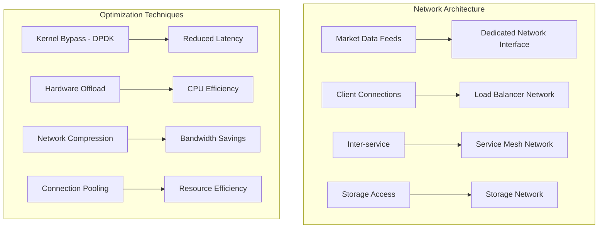

## High Availability and Disaster Recovery

### Multi-Region Deployment

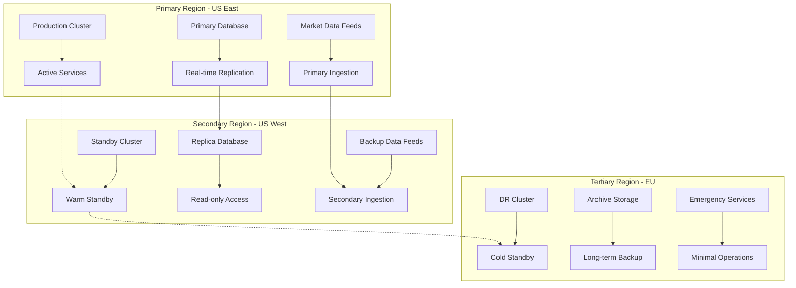

**Disaster Recovery Procedure:**
```yaml
# dr-playbook.yaml
disaster_recovery:
  scenarios:
    primary_region_failure:
      detection:
        - health_check_failures: "> 3 consecutive"
        - network_partition: "> 30 seconds"
        - database_unavailable: "> 10 seconds"
      
      response:
        automated:
          - failover_to_secondary: "30 seconds"
          - dns_update: "60 seconds"
          - notification: "immediate"
        
        manual:
          - assess_damage: "within 5 minutes"
          - communicate_stakeholders: "within 10 minutes"
          - initiate_recovery: "within 30 minutes"
    
    complete_system_failure:
      response:
        - activate_dr_site: "within 1 hour"
        - restore_from_backup: "within 4 hours"
        - verify_data_integrity: "within 6 hours"
        - resume_operations: "within 8 hours"
```

### Health Monitoring and Alerting

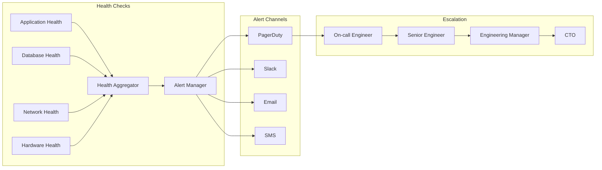

## Security Considerations

### Network Security

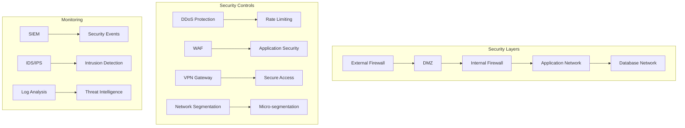

### Data Encryption

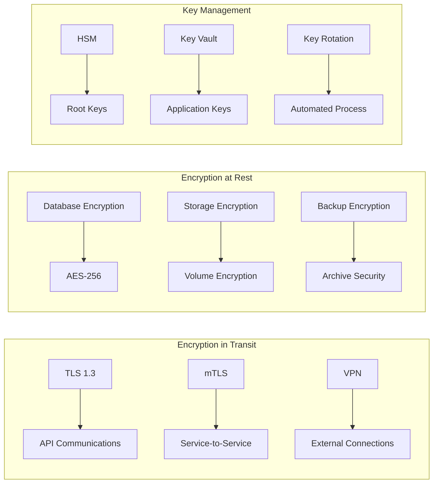

## Operational Procedures

### Deployment Pipeline

```mermaid
graph LR
    A[Source Code] --> B[Build]
    B --> C[Unit Tests]
    C --> D[Integration Tests]
    D --> E[Security Scan]
    E --> F[Performance Tests]
    F --> G[Staging Deployment]
    G --> H[Acceptance Tests]
    H --> I[Production Deployment]
    I --> J[Health Checks]
    J --> K[Traffic Gradual Increase]
    K --> L[Full Production]
```

### Monitoring and Alerting

```yaml
# monitoring-config.yaml
monitoring:
  metrics:
    system:
      - name: "cpu_utilization"
        threshold: 80
        severity: "warning"
      - name: "memory_usage"
        threshold: 90
        severity: "critical"
      - name: "disk_usage"
        threshold: 85
        severity: "warning"
        
    application:
      - name: "api_response_time"
        threshold: "100ms"
        percentile: 95
        severity: "warning"
      - name: "error_rate"
        threshold: 1
        unit: "percent"
        severity: "critical"
        
    financial:
      - name: "market_data_latency"
        threshold: "1ms"
        percentile: 99
        severity: "critical"
      - name: "calculation_accuracy"
        threshold: 99.99
        unit: "percent"
        severity: "critical"
        
  alerts:
    escalation_policy:
      - level: 1
        timeout: "5m"
        contacts: ["oncall-engineer"]
      - level: 2
        timeout: "15m"
        contacts: ["senior-engineer", "team-lead"]
      - level: 3
        timeout: "30m"
        contacts: ["engineering-manager", "cto"]
```

### Capacity Planning

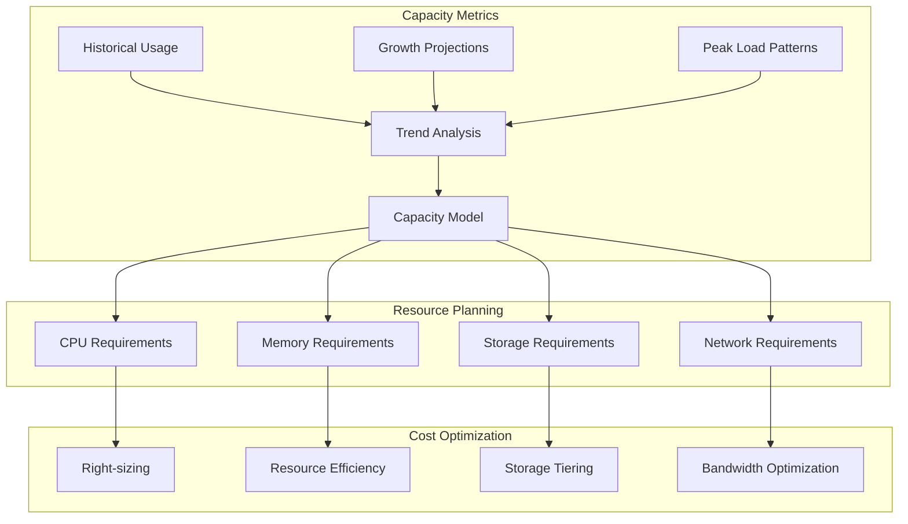

---

*This deployment and scaling guide provides comprehensive coverage for deploying GGNuCash in production environments with enterprise-grade reliability, performance, and security.*