# Financial Hardware Implementation Guide

## Overview

This document provides detailed implementation guidance for deploying GGNuCash on various hardware platforms, with specific optimizations for financial computations and real-time trading requirements.

## Hardware Platform Support

### CPU Backends

#### Intel x86-64 Architecture
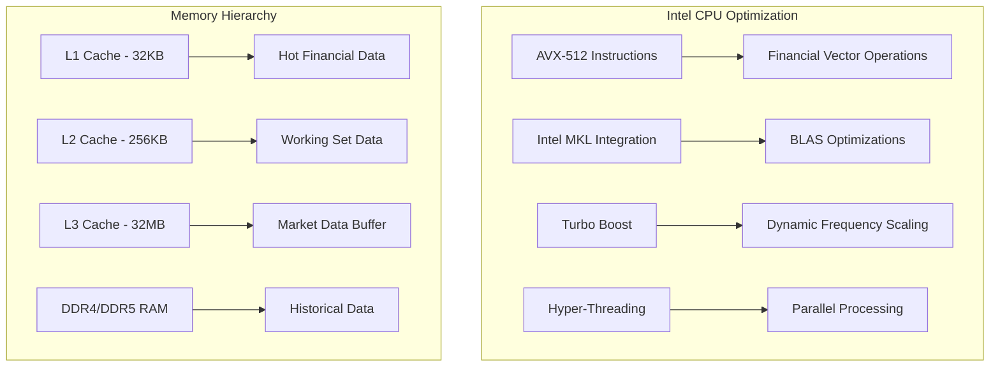

**Optimization Strategies:**
- **Cache-aware algorithms**: Structure financial calculations to maximize L1/L2 cache utilization
- **SIMD vectorization**: Process multiple financial instruments simultaneously
- **Memory prefetching**: Anticipate market data access patterns

#### AMD EPYC Architecture
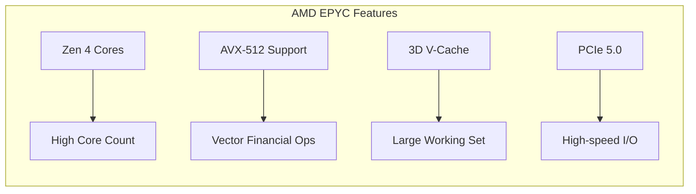

**Key Benefits:**
- Higher core counts for parallel risk scenarios
- Large cache for complex portfolio calculations
- Superior price/performance for compute-intensive workloads

#### ARM Architecture (Apple Silicon)
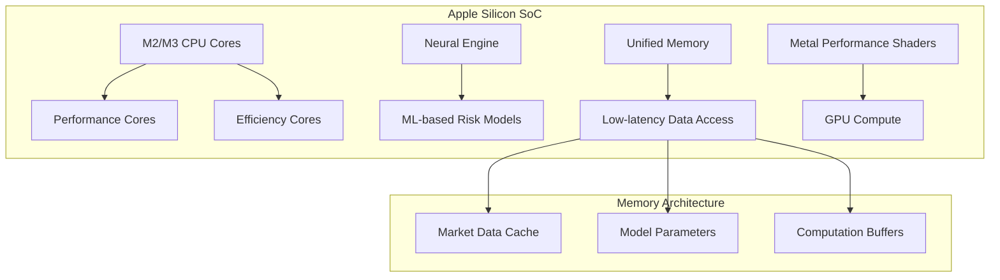

### GPU Acceleration

#### NVIDIA CUDA Implementation
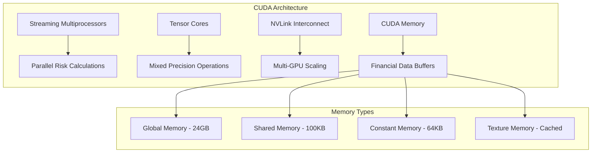

**CUDA Kernel Optimizations:**
```cpp
// Example: Parallel Black-Scholes calculation
__global__ void blackScholes_kernel(
    float* callPrices,
    float* spotPrices,
    float* strikes,
    float* volatilities,
    float* timeToExpiry,
    float riskFreeRate,
    int numOptions
) {
    int idx = blockIdx.x * blockDim.x + threadIdx.x;
    if (idx < numOptions) {
        // Vectorized Black-Scholes calculation
        float d1 = (logf(spotPrices[idx] / strikes[idx]) + 
                   (riskFreeRate + 0.5f * volatilities[idx] * volatilities[idx]) * timeToExpiry[idx]) /
                   (volatilities[idx] * sqrtf(timeToExpiry[idx]));
        
        float d2 = d1 - volatilities[idx] * sqrtf(timeToExpiry[idx]);
        
        callPrices[idx] = spotPrices[idx] * normcdf(d1) - 
                         strikes[idx] * expf(-riskFreeRate * timeToExpiry[idx]) * normcdf(d2);
    }
}
```

#### AMD ROCm Implementation
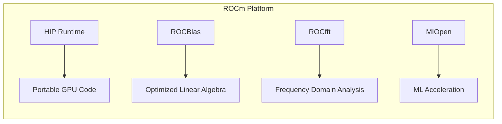

#### Intel GPU (Arc/Xe)
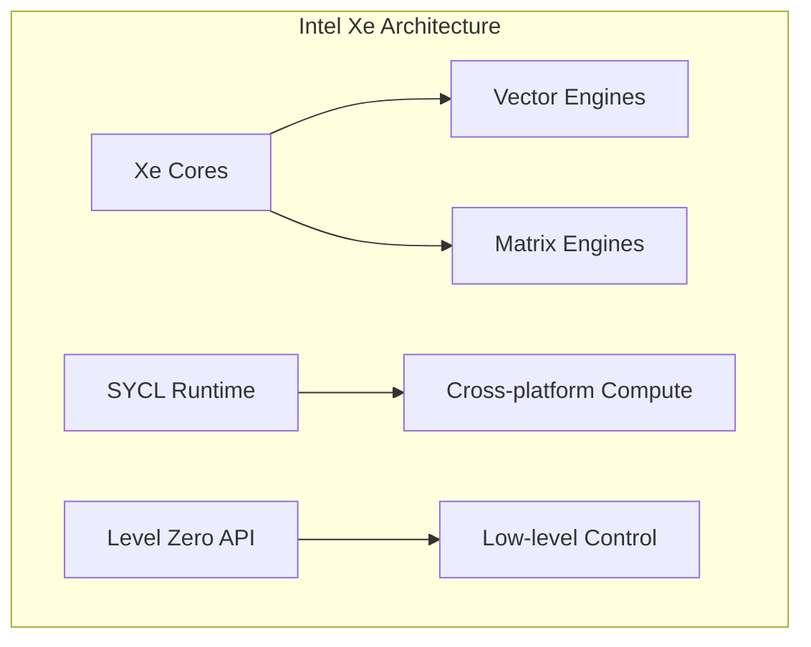

### Specialized Financial Hardware

#### FPGA Acceleration
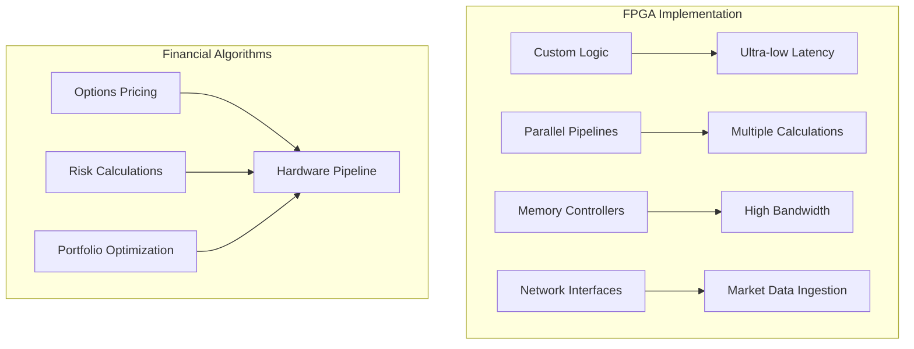

**Latency Characteristics:**
- Market data processing: ~50ns
- Options pricing: ~100ns  
- Risk calculation: ~200ns

#### Application-Specific Integrated Circuits (ASICs)
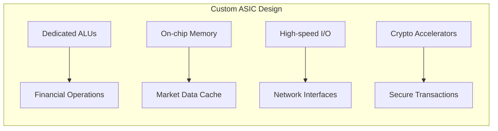

## Network and I/O Optimization

### Market Data Ingestion
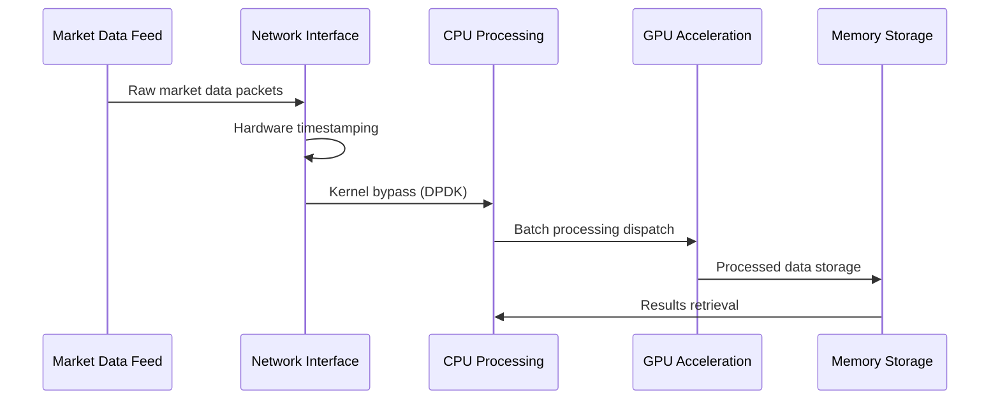

### Low-Latency Networking
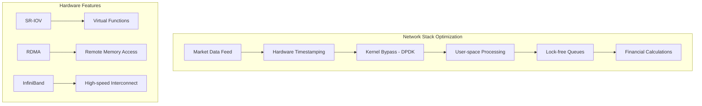

## Memory Architecture and Optimization

### Memory Hierarchy Design
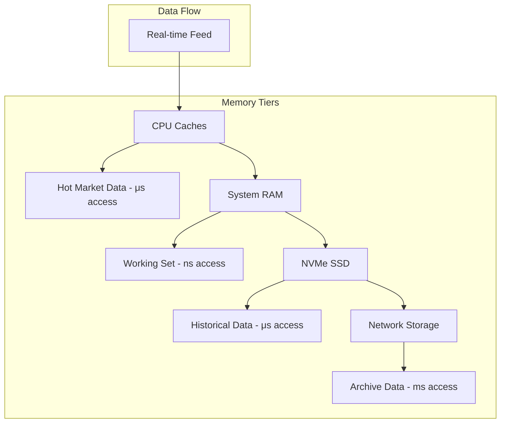

### NUMA Awareness
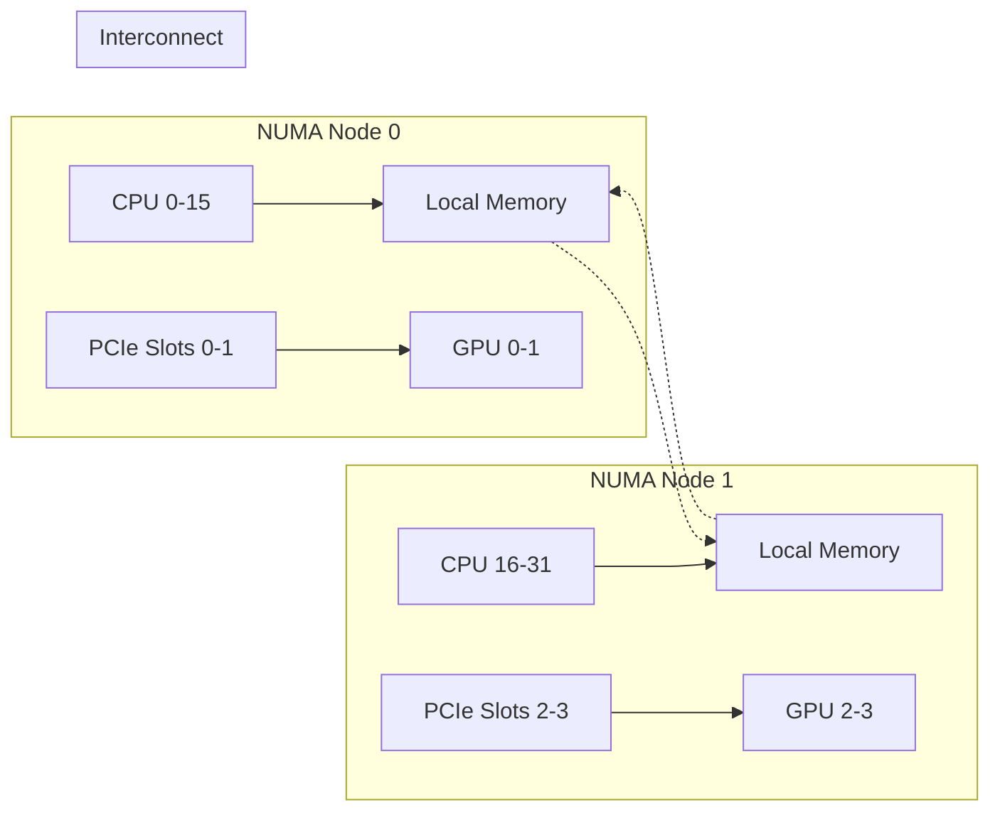

**NUMA Optimization Strategies:**
- Pin financial processing threads to specific NUMA nodes
- Allocate market data buffers on local memory
- Minimize cross-NUMA memory access

## Real-Time Performance Tuning

### CPU Isolation and Affinity
```bash
# Isolate CPUs for financial processing
echo 2-15 > /sys/devices/system/cpu/isolated

# Set thread affinity for critical processes
taskset -c 2-7 ./ggnucash-server --market-data-threads=6

# Configure interrupt affinity
echo 2 > /proc/irq/24/smp_affinity  # Network interrupts to CPU 1
```

### Memory and Swap Configuration
```bash
# Disable swap for predictable latency
swapoff -a

# Configure transparent huge pages
echo never > /sys/kernel/mm/transparent_hugepage/enabled

# Set memory overcommit for deterministic allocation
echo 2 > /proc/sys/vm/overcommit_memory
echo 80 > /proc/sys/vm/overcommit_ratio
```

### Network Tuning
```bash
# Increase network buffer sizes
echo 'net.core.rmem_max = 268435456' >> /etc/sysctl.conf
echo 'net.core.wmem_max = 268435456' >> /etc/sysctl.conf

# Configure interrupt coalescing
ethtool -C eth0 rx-usecs 10 tx-usecs 10

# Enable CPU affinity for network interrupts
echo 1 > /proc/irq/24/smp_affinity
```

## Hardware Monitoring and Telemetry

### Performance Counters
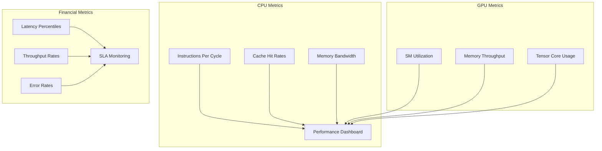

### Hardware Health Monitoring
```cpp
// Example: GPU temperature and power monitoring
#include <nvml.h>

void monitor_gpu_health() {
    nvmlDevice_t device;
    nvmlDeviceGetHandleByIndex(0, &device);
    
    unsigned int temperature;
    nvmlDeviceGetTemperature(device, NVML_TEMPERATURE_GPU, &temperature);
    
    unsigned int power;
    nvmlDeviceGetPowerUsage(device, &power);
    
    // Alert if temperature > 80C or power > 90% TDP
    if (temperature > 80 || power > 270000) {  // 270W for RTX 4090
        trigger_thermal_throttle_alert();
    }
}
```

## Disaster Recovery and Redundancy

### Hardware Failover Architecture
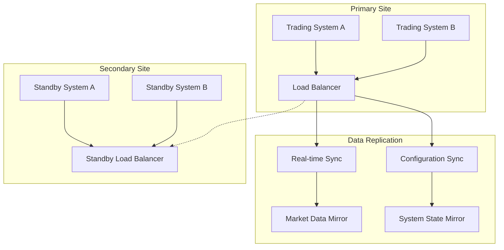

### Hardware Redundancy Strategies
- **N+1 Redundancy**: Extra capacity for component failures
- **Geographic Distribution**: Multiple data centers for disaster recovery
- **Hot Standby**: Immediate failover capabilities
- **Component Monitoring**: Proactive replacement before failure

## Cost Optimization

### Hardware TCO Analysis
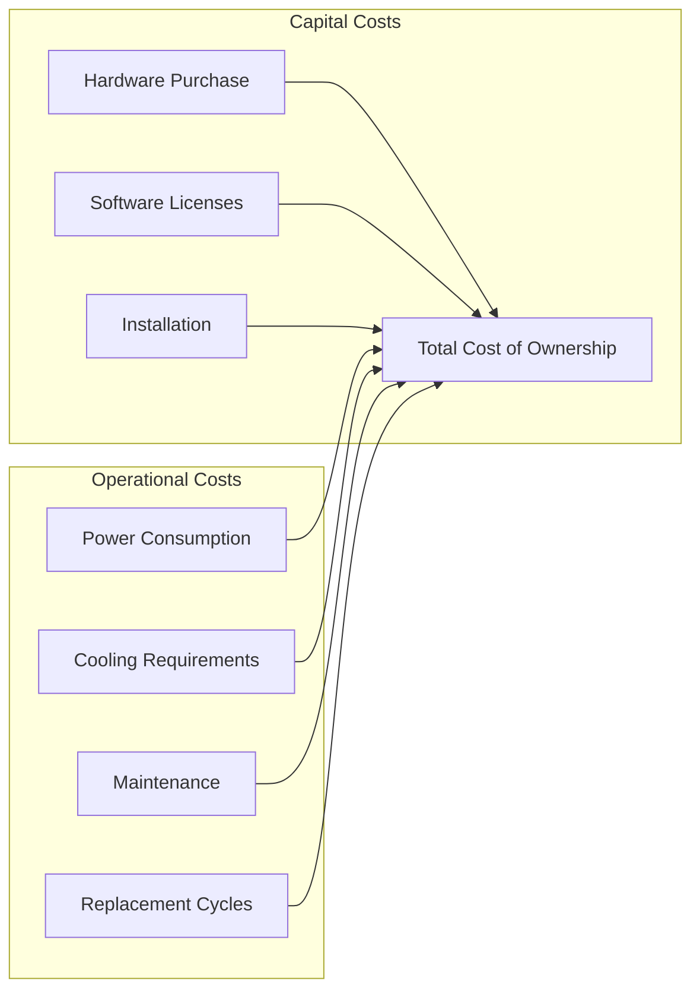

### Power Efficiency Considerations
- **CPU P-states**: Dynamic frequency scaling based on load
- **GPU power management**: Automatic performance level adjustment
- **Memory efficiency**: Optimal capacity vs. power consumption
- **Cooling optimization**: Thermal design for sustained performance

## Compliance and Regulatory Requirements

### Hardware Security Features
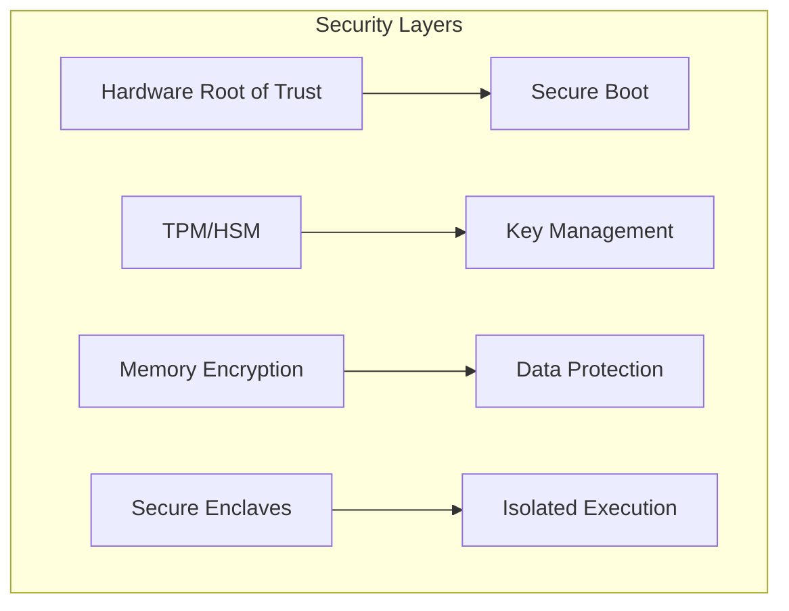

### Audit Trail Requirements
- **Hardware event logging**: Component failures, performance changes
- **Configuration tracking**: Hardware and firmware version control
- **Access control**: Physical and logical security measures
- **Data integrity**: ECC memory, checksums, redundancy

---

*This hardware implementation guide provides comprehensive coverage of deploying GGNuCash across various hardware platforms with optimal performance and reliability for financial applications.*