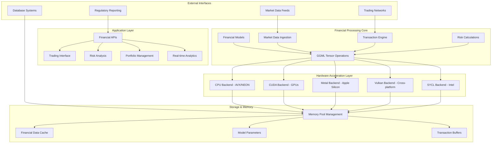
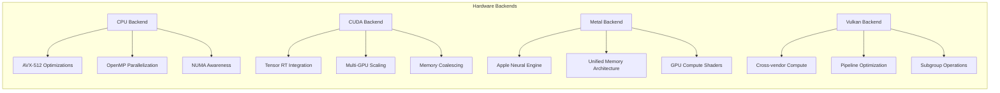
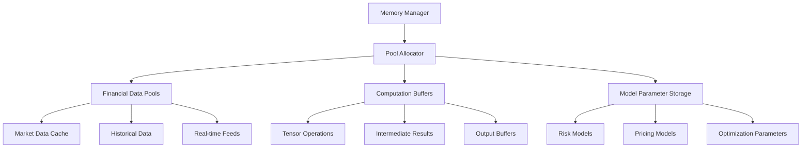
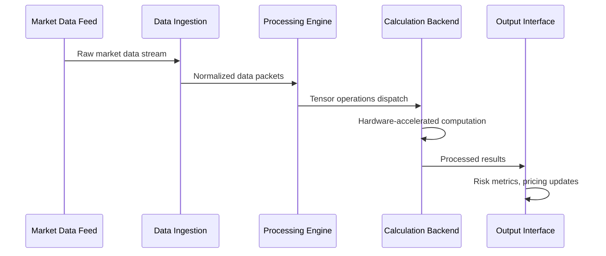
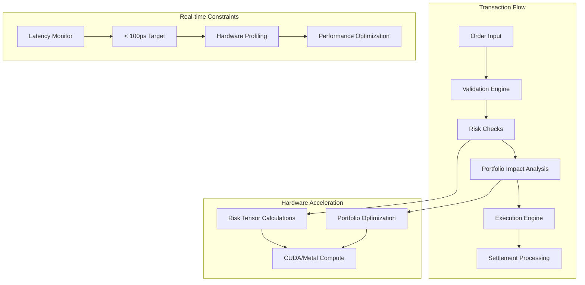
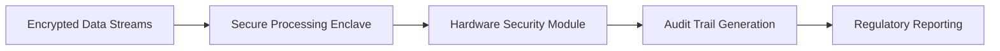
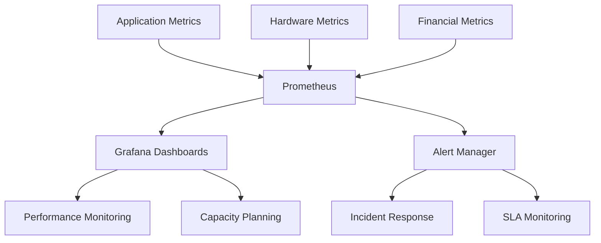
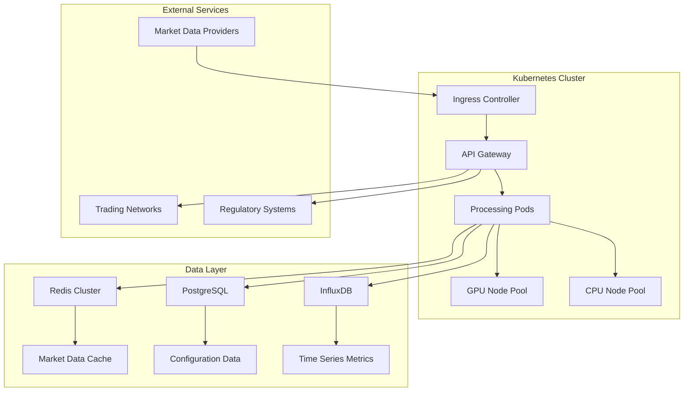

# GGNuCash Financial Hardware Implementation - Technical Architecture

## Overview

GGNuCash is a high-performance financial computation platform built on the GGML tensor library infrastructure, specifically designed for hardware-accelerated financial modeling, risk analysis, and real-time transaction processing. This implementation leverages the proven architecture of llama.cpp to provide efficient financial computations across diverse hardware platforms.

## System Architecture



## Core Components

### 1. Financial Processing Engine

The financial processing engine is built on top of the GGML tensor library, providing:

- **High-frequency trading calculations**: Optimized for microsecond-level latency
- **Risk modeling**: Monte Carlo simulations, VaR calculations, stress testing
- **Portfolio optimization**: Multi-objective optimization using tensor operations
- **Real-time analytics**: Streaming financial data processing

### 2. Hardware Acceleration Backends



### 3. Memory Management System



## Financial Hardware Implementation Details

### Market Data Processing Pipeline



### Transaction Processing Architecture



### Computational Financial Models

The system implements several key financial models optimized for hardware acceleration:

#### 1. Black-Scholes Options Pricing
- Vectorized calculations across option chains
- GPU-parallel Greeks computation
- Real-time volatility surface interpolation

#### 2. Monte Carlo Risk Simulations
- Parallel random number generation
- Distributed scenario execution across GPU cores
- Efficient reduction operations for statistical aggregation

#### 3. Portfolio Optimization
- Quadratic programming solver optimized for GPU execution
- Constraint handling using tensor operations
- Multi-objective optimization with Pareto frontier computation

## Hardware Requirements and Recommendations

### Minimum Requirements
- **CPU**: 4+ cores, AVX2 support
- **Memory**: 16GB RAM
- **Storage**: 100GB SSD for market data cache
- **Network**: Low-latency connection to market data providers

### Recommended High-Performance Setup
- **CPU**: Intel Xeon or AMD EPYC with AVX-512
- **GPU**: NVIDIA RTX 4090 or Tesla V100 for CUDA acceleration
- **Memory**: 64GB+ RAM with high-bandwidth modules
- **Storage**: NVMe SSD array with RAID 0 configuration
- **Network**: 10Gbps+ with hardware timestamping support

### Apple Silicon Optimization
- **Mac Studio**: M2 Ultra with unified memory architecture
- **Metal Performance Shaders**: Optimized financial kernels
- **Neural Engine**: Specialized tensor operations for risk modeling

## Performance Characteristics

### Latency Targets
- **Market data ingestion**: < 10μs
- **Risk calculation**: < 50μs
- **Portfolio rebalancing**: < 100μs
- **Options pricing**: < 25μs per instrument

### Throughput Capabilities
- **Order processing**: 1M+ orders/second
- **Market data updates**: 10M+ ticks/second
- **Risk calculations**: 100K+ scenarios/second
- **Historical analysis**: 10+ years of data in minutes

## Security and Compliance

### Data Protection


### Compliance Features
- **SOX Compliance**: Immutable audit trails
- **Basel III**: Real-time capital adequacy monitoring
- **MiFID II**: Transaction reporting and best execution
- **GDPR**: Data privacy and protection controls

## API Integration

### REST API Endpoints
```
POST /api/v1/portfolio/analyze
GET  /api/v1/market/realtime/{symbol}
POST /api/v1/risk/calculate
GET  /api/v1/performance/metrics
```

### WebSocket Streams
```
ws://api/stream/market-data
ws://api/stream/portfolio-updates
ws://api/stream/risk-alerts
```

### gRPC Services
- High-performance binary protocol for internal services
- Streaming interfaces for real-time data feeds
- Load balancing and service discovery integration

## Monitoring and Observability



## Deployment Architecture

### Cloud-Native Deployment


### Edge Computing Setup
- **Low-latency regions**: Co-location with major exchanges
- **Data replication**: Real-time synchronization across regions
- **Failover mechanisms**: Automatic switching to backup systems

## Development and Testing

### Build System Integration
```bash
# Configure for financial hardware acceleration
cmake -B build -DGGML_CUDA=ON -DGGML_FINANCIAL=ON
cmake --build build --config Release --parallel

# Run financial-specific tests
ctest --test-dir build --output-on-failure -R financial
```

### Testing Framework
- **Unit tests**: Individual financial functions
- **Integration tests**: End-to-end processing pipelines
- **Performance tests**: Latency and throughput benchmarks
- **Stress tests**: High-load scenario validation

### Continuous Integration
- Automated builds across multiple hardware platforms
- Performance regression testing
- Security vulnerability scanning
- Compliance validation checks

## Future Roadmap

### Planned Enhancements
1. **Quantum Computing Integration**: Hybrid classical-quantum algorithms
2. **AI/ML Models**: Enhanced predictive capabilities
3. **Blockchain Integration**: DeFi protocol compatibility
4. **Advanced Analytics**: Real-time ESG scoring and carbon footprint analysis

### Hardware Evolution
- Support for emerging accelerators (TPUs, FPGAs)
- Optimizations for next-generation CPU architectures
- Integration with specialized financial hardware platforms

---

*This document provides a comprehensive overview of the GGNuCash financial hardware implementation. For specific implementation details, please refer to the individual component documentation in the respective subdirectories.*