# GGNuCash Security and Compliance Framework

## Overview

GGNuCash implements a comprehensive security and compliance framework designed to meet the stringent requirements of financial institutions and regulatory bodies worldwide. This document outlines the security architecture, compliance mechanisms, and operational procedures for maintaining a secure financial processing environment.

## Security Architecture

### Defense in Depth Strategy

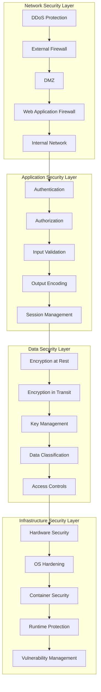

### Authentication and Authorization

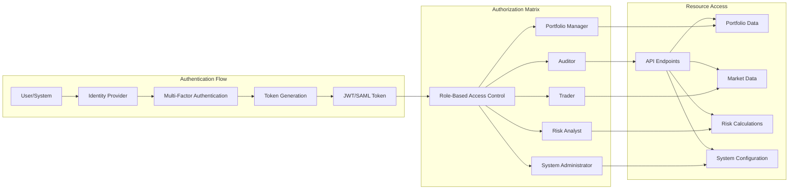

**RBAC Configuration:**
```yaml
# rbac-config.yaml
roles:
  portfolio_manager:
    permissions:
      - "portfolio:read"
      - "portfolio:write"
      - "risk:calculate"
      - "market_data:read"
    resources:
      - "portfolios/*"
      - "risk_models/standard"
    restrictions:
      - max_portfolio_value: "100M"
      - trading_hours_only: true
      
  risk_analyst:
    permissions:
      - "portfolio:read"
      - "risk:read"
      - "risk:calculate"
      - "risk:stress_test"
      - "market_data:read"
    resources:
      - "portfolios/*"
      - "risk_models/*"
      - "stress_scenarios/*"
    restrictions:
      - no_trading_access: true
      
  trader:
    permissions:
      - "portfolio:read"
      - "orders:create"
      - "orders:cancel"
      - "market_data:read"
      - "risk:read"
    resources:
      - "portfolios/assigned"
      - "orders/own"
    restrictions:
      - max_order_size: "1M"
      - trading_hours_only: true
      - risk_limits_enforced: true
      
  auditor:
    permissions:
      - "audit:read"
      - "logs:read"
      - "reports:generate"
    resources:
      - "audit_logs/*"
      - "transaction_logs/*"
      - "compliance_reports/*"
    restrictions:
      - read_only: true
      - no_pii_access: false
```

### Encryption Framework

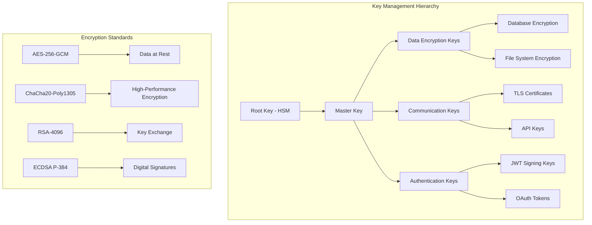

**Encryption Configuration:**
```yaml
# encryption-config.yaml
encryption:
  at_rest:
    algorithm: "AES-256-GCM"
    key_derivation: "PBKDF2-SHA512"
    key_rotation_interval: "90d"
    
  in_transit:
    tls_version: "1.3"
    cipher_suites:
      - "TLS_AES_256_GCM_SHA384"
      - "TLS_CHACHA20_POLY1305_SHA256"
    certificate_authority: "internal_ca"
    
  key_management:
    hsm:
      provider: "aws_cloudhsm"
      key_spec: "RSA_4096"
      key_usage: "ENCRYPT_DECRYPT"
    
    key_rotation:
      automatic: true
      schedule: "0 2 * * 0"  # Weekly on Sunday at 2 AM
      notification: ["security@ggnucash.com"]
```

## Compliance Frameworks

### Regulatory Compliance Matrix

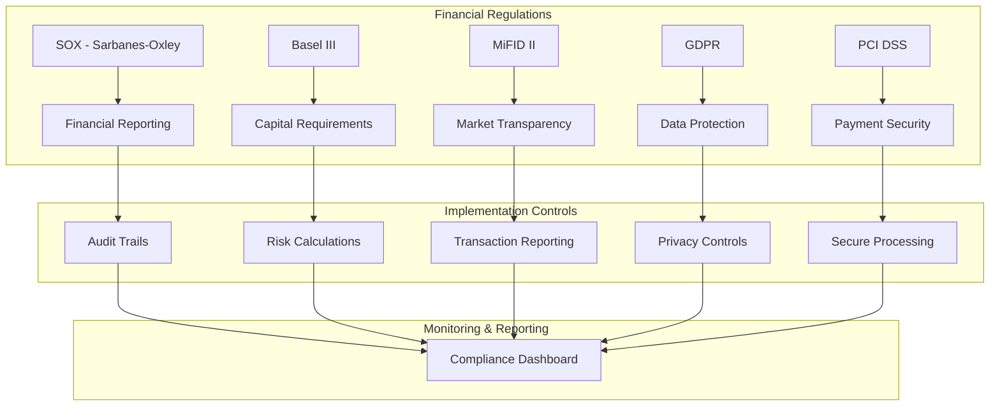

### SOX Compliance Implementation

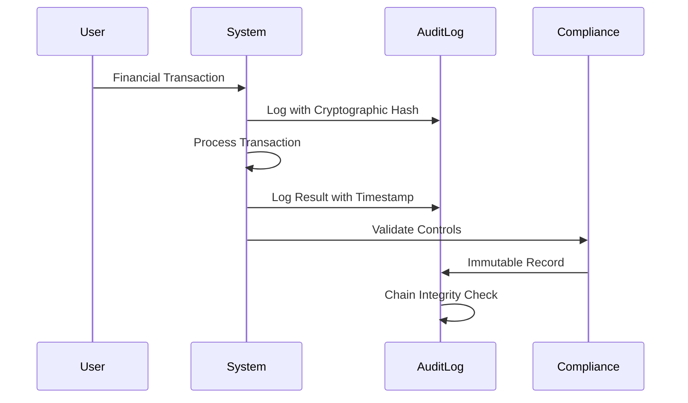

**SOX Controls Configuration:**
```yaml
# sox-controls.yaml
sox_compliance:
  financial_reporting:
    controls:
      - id: "FR-001"
        description: "All financial calculations must be auditable"
        implementation: "cryptographic_audit_trail"
        testing_frequency: "daily"
        
      - id: "FR-002"
        description: "Data integrity verification required"
        implementation: "checksum_validation"
        testing_frequency: "real_time"
        
      - id: "FR-003"
        description: "User access changes must be logged"
        implementation: "rbac_audit_log"
        testing_frequency: "continuous"
    
  audit_trail:
    immutable: true
    retention_period: "7_years"
    hash_algorithm: "SHA-256"
    digital_signature: true
    
  change_management:
    approval_required: true
    segregation_of_duties: true
    emergency_procedures: true
    documentation_required: true
```

### GDPR Data Protection

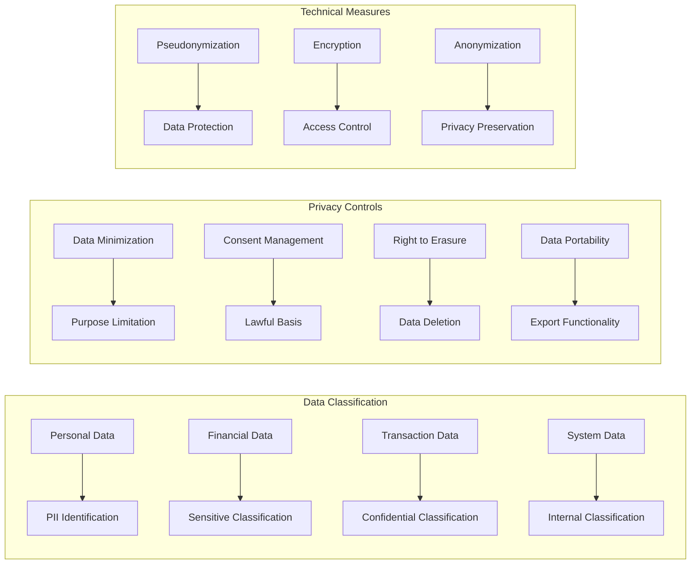

**GDPR Implementation:**
```yaml
# gdpr-compliance.yaml
gdpr:
  data_protection:
    principles:
      - lawfulness: "legitimate_interest"
      - purpose_limitation: "financial_services"
      - data_minimization: "necessary_only"
      - accuracy: "real_time_validation"
      - storage_limitation: "retention_policy"
      - integrity_confidentiality: "encryption_access_control"
      
  individual_rights:
    right_to_information:
      privacy_notice: "provided_at_collection"
      transparency: "clear_language"
      
    right_of_access:
      response_time: "30_days"
      format: "structured_data"
      
    right_to_rectification:
      correction_process: "automated_where_possible"
      notification: "third_parties_informed"
      
    right_to_erasure:
      deletion_process: "secure_overwrite"
      exceptions: "legal_obligations"
      
    right_to_portability:
      export_format: "json_csv"
      transmission: "secure_channel"
```

### Basel III Capital Requirements

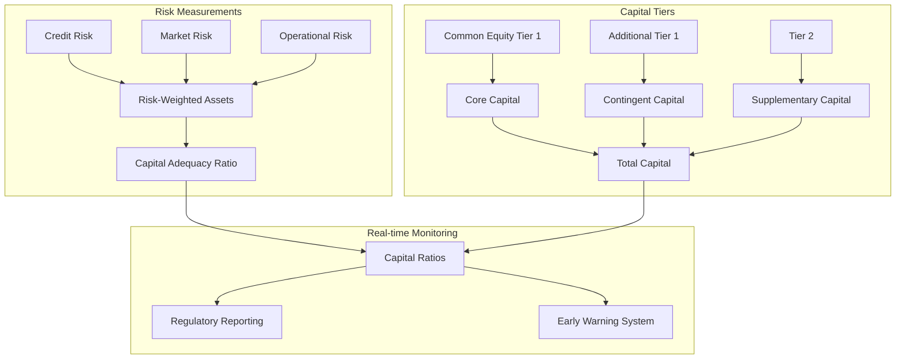

## Security Monitoring and Incident Response

### Security Operations Center (SOC)

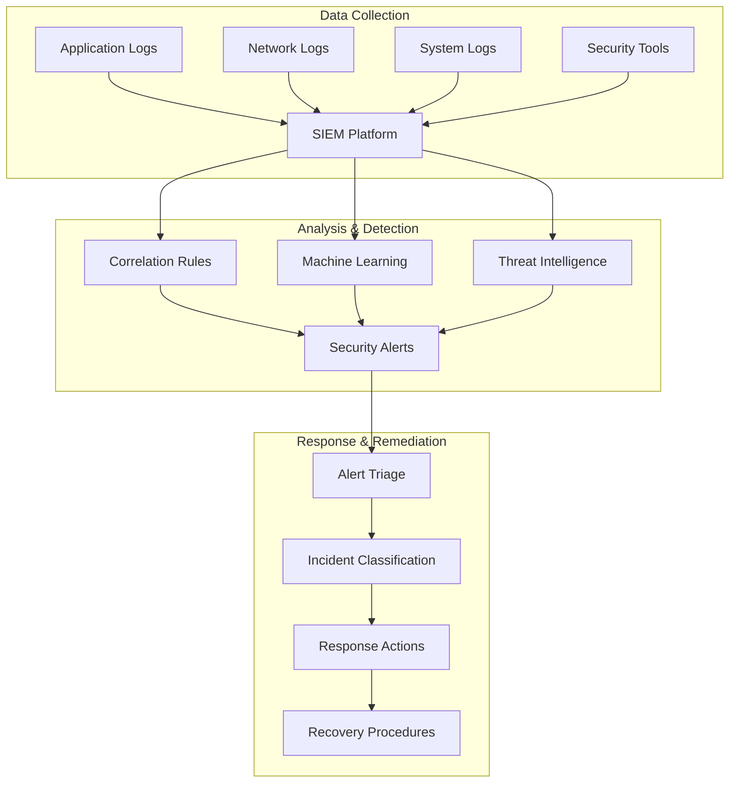

**SIEM Configuration:**
```yaml
# siem-config.yaml
siem:
  data_sources:
    - name: "application_logs"
      type: "ggnucash_server"
      format: "json"
      frequency: "real_time"
      
    - name: "database_logs"
      type: "postgresql"
      format: "structured"
      frequency: "real_time"
      
    - name: "network_logs"
      type: "firewall"
      format: "syslog"
      frequency: "real_time"
      
    - name: "host_logs"
      type: "os_events"
      format: "json"
      frequency: "real_time"
  
  correlation_rules:
    - rule_id: "AUTH_001"
      description: "Multiple failed login attempts"
      condition: "failed_logins > 5 in 5m"
      severity: "medium"
      
    - rule_id: "DATA_001"
      description: "Unusual data access patterns"
      condition: "data_volume > baseline * 3"
      severity: "high"
      
    - rule_id: "FINANCE_001"
      description: "Suspicious financial transactions"
      condition: "transaction_amount > limit AND after_hours"
      severity: "critical"
  
  automated_responses:
    - trigger: "AUTH_001"
      action: "temporary_account_lockout"
      duration: "15m"
      
    - trigger: "DATA_001"
      action: "rate_limit_user"
      parameters: "50% reduction"
      
    - trigger: "FINANCE_001"
      action: "halt_processing_notify_security"
      escalation: "immediate"
```

### Incident Response Procedures

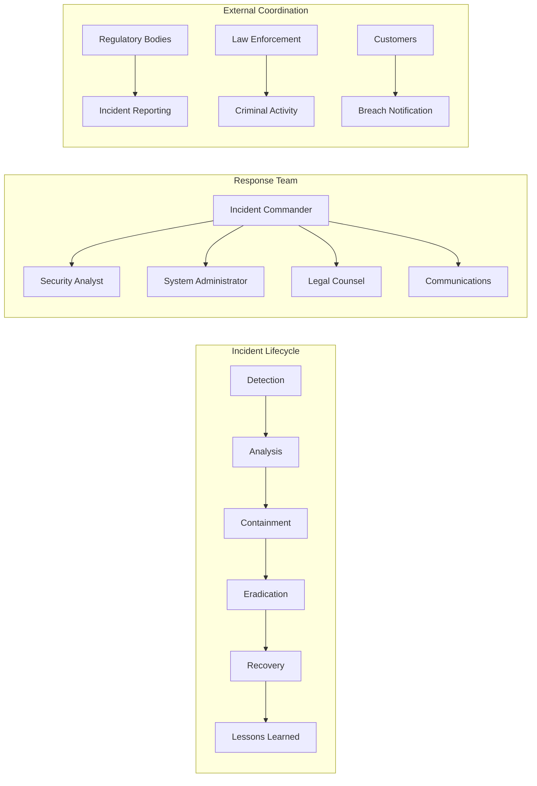

**Incident Response Playbook:**
```yaml
# incident-response.yaml
incident_response:
  severity_levels:
    critical:
      description: "System compromise or data breach"
      response_time: "15_minutes"
      escalation: "immediate"
      
    high:
      description: "Service disruption or security control failure"
      response_time: "1_hour"
      escalation: "within_2_hours"
      
    medium:
      description: "Policy violation or suspicious activity"
      response_time: "4_hours"
      escalation: "within_24_hours"
      
    low:
      description: "Minor security event"
      response_time: "24_hours"
      escalation: "weekly_review"
  
  procedures:
    data_breach:
      immediate_actions:
        - "isolate_affected_systems"
        - "preserve_evidence"
        - "assess_scope"
        - "notify_incident_commander"
      
      investigation:
        - "forensic_imaging"
        - "log_analysis"
        - "interview_personnel"
        - "document_findings"
      
      notification:
        - "legal_review: 2_hours"
        - "regulatory_notification: 72_hours"
        - "customer_notification: as_required"
        - "public_disclosure: as_required"
    
    system_compromise:
      immediate_actions:
        - "network_segmentation"
        - "system_isolation"
        - "credential_reset"
        - "activate_backup_systems"
      
      recovery:
        - "malware_removal"
        - "system_hardening"
        - "vulnerability_patching"
        - "monitoring_enhancement"
```

## Vulnerability Management

### Security Testing Framework

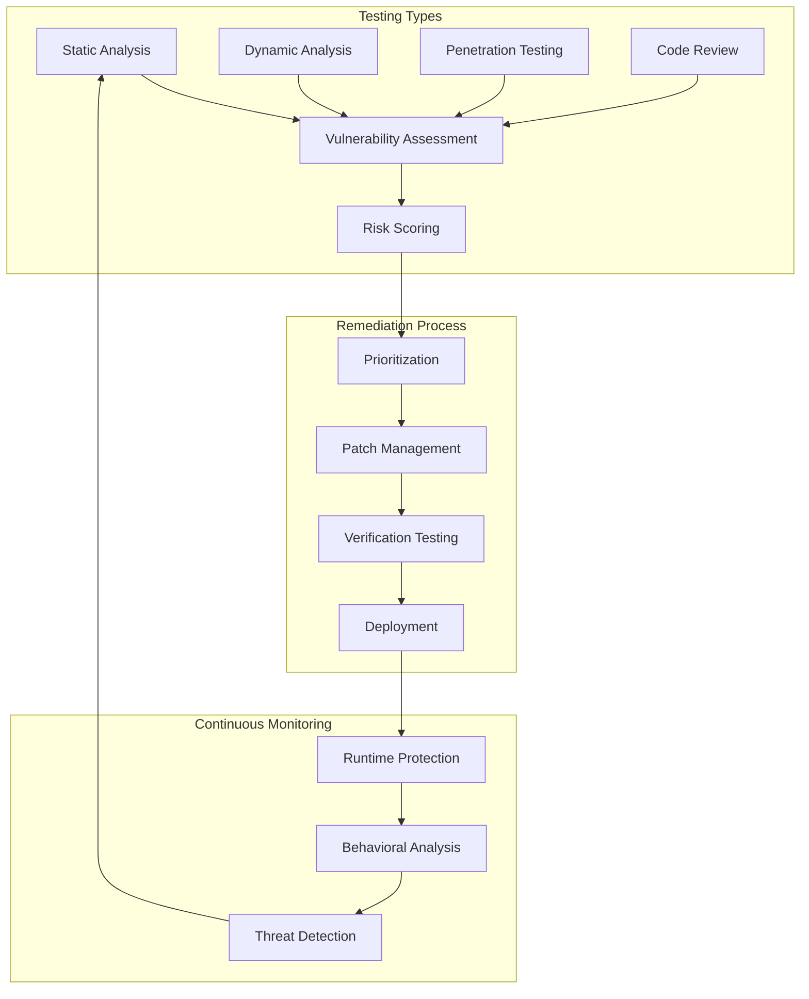

**Vulnerability Management Configuration:**
```yaml
# vulnerability-management.yaml
vulnerability_management:
  scanning:
    static_analysis:
      tools: ["sonarqube", "veracode", "checkmarx"]
      frequency: "every_commit"
      threshold: "zero_high_severity"
      
    dynamic_analysis:
      tools: ["owasp_zap", "burp_suite"]
      frequency: "nightly"
      scope: "all_endpoints"
      
    infrastructure_scanning:
      tools: ["nessus", "qualys", "rapid7"]
      frequency: "weekly"
      scope: "all_assets"
  
  remediation:
    sla:
      critical: "24_hours"
      high: "72_hours"
      medium: "30_days"
      low: "90_days"
    
    exception_process:
      approval_required: "ciso_approval"
      business_justification: "required"
      compensating_controls: "mandatory"
      review_period: "quarterly"
```

## Business Continuity and Disaster Recovery

### Business Impact Analysis

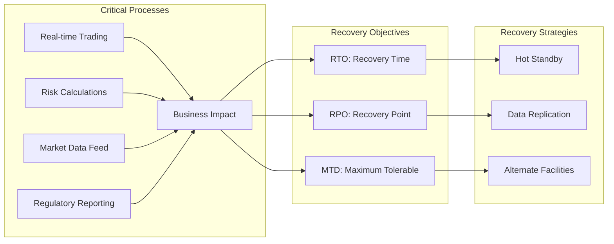

**Business Continuity Plan:**
```yaml
# business-continuity.yaml
business_continuity:
  critical_functions:
    trading_operations:
      rto: "30_seconds"
      rpo: "0_seconds"
      priority: "critical"
      dependencies: ["market_data", "risk_engine"]
      
    risk_management:
      rto: "5_minutes"
      rpo: "1_minute"
      priority: "high"
      dependencies: ["portfolio_data", "market_data"]
      
    regulatory_reporting:
      rto: "4_hours"
      rpo: "15_minutes"
      priority: "medium"
      dependencies: ["transaction_data", "compliance_engine"]
  
  recovery_sites:
    hot_site:
      location: "us_west_2"
      capacity: "100%"
      failover_time: "automatic_30s"
      
    warm_site:
      location: "eu_central_1"
      capacity: "75%"
      failover_time: "manual_30m"
      
    cold_site:
      location: "ap_southeast_1"
      capacity: "50%"
      failover_time: "manual_4h"
```

## Privacy and Data Governance

### Data Lifecycle Management

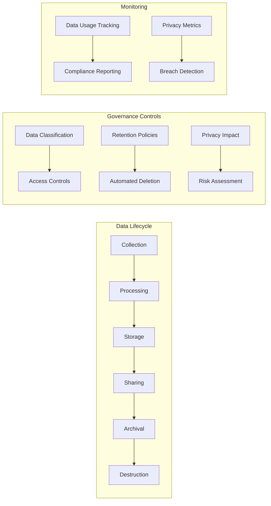

**Data Governance Framework:**
```yaml
# data-governance.yaml
data_governance:
  classification:
    public:
      protection_level: "basic"
      access_control: "none"
      retention: "indefinite"
      
    internal:
      protection_level: "standard"
      access_control: "authenticated_users"
      retention: "7_years"
      
    confidential:
      protection_level: "enhanced"
      access_control: "role_based"
      retention: "business_need"
      
    restricted:
      protection_level: "maximum"
      access_control: "explicit_authorization"
      retention: "legal_minimum"
  
  privacy_controls:
    data_minimization:
      collection: "necessary_only"
      processing: "purpose_limited"
      retention: "automatic_deletion"
      
    consent_management:
      granular_consent: true
      withdrawal_process: "self_service"
      consent_tracking: "immutable_log"
      
    individual_rights:
      access_requests: "automated_response"
      correction_requests: "workflow_driven"
      deletion_requests: "verified_processing"
```

---

*This comprehensive security and compliance framework ensures GGNuCash meets the highest standards for financial industry security, regulatory compliance, and data protection requirements.*