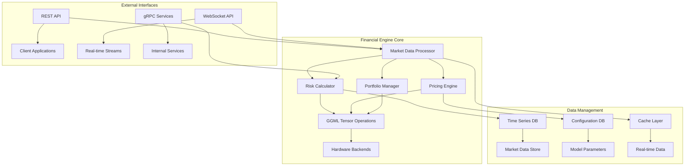
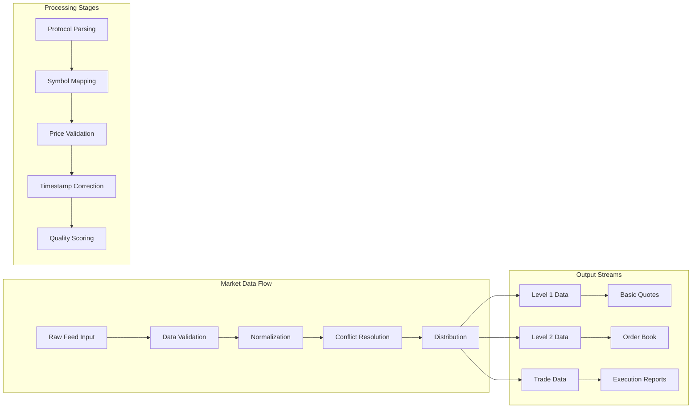
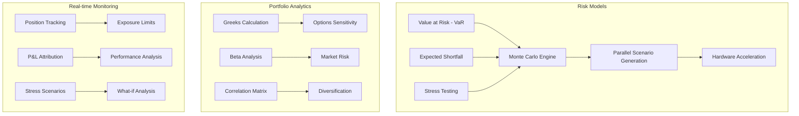
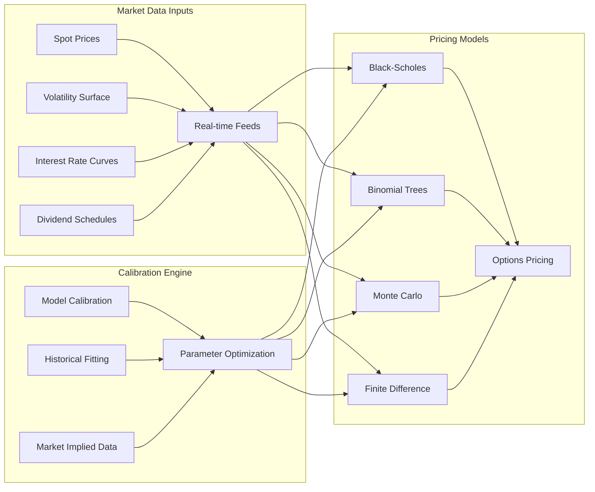
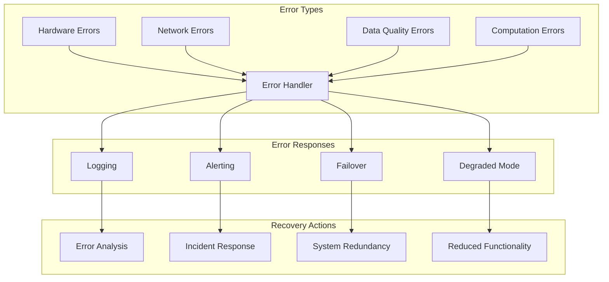
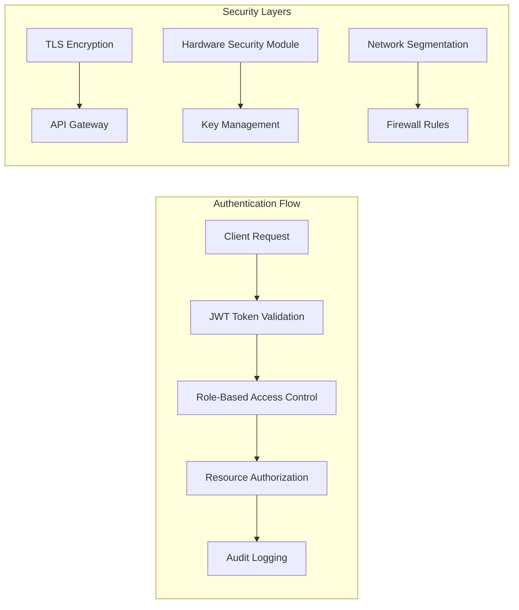

# GGNuCash System Components and API Reference

## Component Architecture

### Core Financial Engine Components



### Market Data Processing Component



**Key Features:**
- **Multi-feed aggregation**: Combine data from multiple market data providers
- **Latency optimization**: Sub-microsecond processing with hardware timestamping
- **Quality assurance**: Real-time data validation and correction
- **Conflation**: Intelligent data compression for bandwidth optimization

### Risk Calculation Engine



### Pricing Engine Architecture



## API Reference

### REST API Endpoints

#### Market Data API
```http
GET /api/v1/market/quote/{symbol}
Response: {
  "symbol": "AAPL",
  "bid": 175.25,
  "ask": 175.27,
  "last": 175.26,
  "timestamp": "2024-01-15T10:30:00.123456Z",
  "volume": 1234567
}

GET /api/v1/market/orderbook/{symbol}
Response: {
  "symbol": "AAPL",
  "bids": [
    {"price": 175.25, "size": 1000, "time": "2024-01-15T10:30:00.123Z"},
    {"price": 175.24, "size": 500, "time": "2024-01-15T10:29:59.456Z"}
  ],
  "asks": [
    {"price": 175.27, "size": 800, "time": "2024-01-15T10:30:00.234Z"},
    {"price": 175.28, "size": 1200, "time": "2024-01-15T10:29:58.789Z"}
  ]
}
```

#### Portfolio Management API
```http
POST /api/v1/portfolio/analyze
Content-Type: application/json
{
  "portfolio_id": "portfolio_123",
  "positions": [
    {"symbol": "AAPL", "quantity": 1000, "average_price": 170.50},
    {"symbol": "MSFT", "quantity": 500, "average_price": 380.25}
  ],
  "analysis_type": "var_calculation",
  "confidence_level": 0.95,
  "time_horizon": "1d"
}

Response: {
  "portfolio_id": "portfolio_123",
  "value_at_risk": {
    "amount": 45230.75,
    "percentage": 2.85,
    "confidence_level": 0.95,
    "time_horizon": "1d"
  },
  "expected_shortfall": 67845.12,
  "beta": 1.23,
  "correlation_matrix": [...],
  "calculation_time_ms": 12.5
}
```

#### Risk Management API
```http
POST /api/v1/risk/calculate
Content-Type: application/json
{
  "calculation_type": "monte_carlo_var",
  "portfolio": {
    "positions": [...],
    "total_value": 1500000.00
  },
  "parameters": {
    "simulations": 100000,
    "confidence_level": 0.99,
    "time_horizon": "10d"
  },
  "use_gpu": true
}

Response: {
  "var_results": {
    "absolute_var": 125000.00,
    "relative_var": 8.33,
    "expected_shortfall": 187500.00,
    "worst_case_scenario": -245000.00
  },
  "computation_stats": {
    "simulations_completed": 100000,
    "execution_time_ms": 45.2,
    "hardware_used": "CUDA_GPU_0",
    "memory_peak_mb": 2048
  }
}
```

#### Options Pricing API
```http
POST /api/v1/pricing/options/black_scholes
Content-Type: application/json
{
  "underlying": {
    "symbol": "AAPL",
    "spot_price": 175.26,
    "volatility": 0.28
  },
  "option": {
    "strike": 180.00,
    "expiry": "2024-03-15",
    "option_type": "call"
  },
  "market_data": {
    "risk_free_rate": 0.045,
    "dividend_yield": 0.015
  }
}

Response: {
  "option_price": 8.47,
  "greeks": {
    "delta": 0.3542,
    "gamma": 0.0089,
    "theta": -0.0156,
    "vega": 0.2847,
    "rho": 0.1234
  },
  "implied_volatility": 0.2834,
  "calculation_method": "black_scholes_gpu",
  "execution_time_μs": 23.7
}
```

### WebSocket API

#### Real-time Market Data Stream
```javascript
// Connection
const ws = new WebSocket('wss://api.ggnucash.com/stream/market');

// Subscription
ws.send(JSON.stringify({
  "action": "subscribe",
  "channels": ["quotes", "trades", "orderbook"],
  "symbols": ["AAPL", "MSFT", "GOOGL"]
}));

// Incoming data
{
  "channel": "quotes",
  "symbol": "AAPL",
  "data": {
    "bid": 175.25,
    "ask": 175.27,
    "timestamp": "2024-01-15T10:30:00.123456Z"
  }
}
```

#### Portfolio Updates Stream
```javascript
// Risk monitoring stream
ws.send(JSON.stringify({
  "action": "subscribe",
  "channel": "portfolio_risk",
  "portfolio_id": "portfolio_123",
  "alert_thresholds": {
    "var_limit": 50000.00,
    "concentration_limit": 0.10
  }
}));

// Risk alert
{
  "channel": "portfolio_risk",
  "portfolio_id": "portfolio_123",
  "alert": {
    "type": "var_breach",
    "current_var": 52340.75,
    "limit": 50000.00,
    "severity": "high",
    "timestamp": "2024-01-15T10:30:00.123456Z"
  }
}
```

### gRPC Services

#### Portfolio Service
```protobuf
service PortfolioService {
  rpc GetPortfolio(GetPortfolioRequest) returns (Portfolio);
  rpc UpdatePosition(UpdatePositionRequest) returns (Position);
  rpc CalculateRisk(RiskCalculationRequest) returns (RiskMetrics);
  rpc StreamPortfolioUpdates(PortfolioStreamRequest) returns (stream PortfolioUpdate);
}

message Portfolio {
  string portfolio_id = 1;
  repeated Position positions = 2;
  double total_value = 3;
  RiskMetrics current_risk = 4;
  google.protobuf.Timestamp last_updated = 5;
}

message RiskMetrics {
  double value_at_risk = 1;
  double expected_shortfall = 2;
  double beta = 3;
  repeated double correlation_matrix = 4;
  ComputationStats stats = 5;
}
```

#### Market Data Service
```protobuf
service MarketDataService {
  rpc GetQuote(QuoteRequest) returns (Quote);
  rpc GetOrderBook(OrderBookRequest) returns (OrderBook);
  rpc StreamMarketData(MarketDataStreamRequest) returns (stream MarketDataUpdate);
  rpc GetHistoricalData(HistoricalDataRequest) returns (HistoricalDataResponse);
}

message Quote {
  string symbol = 1;
  double bid = 2;
  double ask = 3;
  double last = 4;
  int64 volume = 5;
  google.protobuf.Timestamp timestamp = 6;
  MarketDataQuality quality = 7;
}

enum MarketDataQuality {
  REAL_TIME = 0;
  DELAYED = 1;
  STALE = 2;
  ESTIMATED = 3;
}
```

## Configuration Management

### System Configuration
```yaml
# ggnucash.yaml
system:
  hardware:
    cpu_backend: true
    gpu_backend: true
    gpu_devices: [0, 1]  # Use GPUs 0 and 1
    memory_pool_size: "8GB"
    
  performance:
    max_threads: 16
    numa_aware: true
    cpu_affinity: [2, 3, 4, 5, 6, 7, 8, 9]
    
  market_data:
    providers:
      - name: "bloomberg"
        endpoint: "tcp://feed.bloomberg.com:8194"
        protocol: "bpipe"
        priority: 1
      - name: "refinitiv"
        endpoint: "tcp://feed.refinitiv.com:14002"
        protocol: "rmds"
        priority: 2
        
    buffer_size: "1GB"
    conflation_interval: "1ms"
    
  risk_management:
    var_confidence_levels: [0.95, 0.99]
    monte_carlo_simulations: 100000
    stress_test_scenarios: 50
    calculation_frequency: "5s"
```

### Hardware-Specific Optimizations
```yaml
# hardware-profiles.yaml
profiles:
  high_frequency_trading:
    cpu:
      isolated_cores: [2-15]
      governor: "performance"
      c_states: disabled
    memory:
      huge_pages: enabled
      numa_balancing: disabled
    network:
      interrupt_affinity: [0, 1]
      buffer_sizes:
        rx: "64MB"
        tx: "64MB"
        
  risk_calculation:
    gpu:
      devices: ["cuda:0", "cuda:1", "cuda:2", "cuda:3"]
      memory_fraction: 0.9
      compute_mode: "exclusive"
    cpu:
      threads_per_core: 2
      affinity_policy: "spread"
```

## Error Handling and Monitoring

### Error Classification


### Monitoring and Observability
```yaml
# monitoring.yaml
metrics:
  system:
    - name: "cpu_utilization"
      interval: "1s"
      threshold: 80
    - name: "memory_usage"
      interval: "1s"
      threshold: 90
    - name: "gpu_temperature"
      interval: "5s"
      threshold: 85
      
  financial:
    - name: "market_data_latency"
      interval: "100ms"
      p99_threshold: "500μs"
    - name: "calculation_latency"
      interval: "1s"
      p99_threshold: "10ms"
    - name: "error_rate"
      interval: "1s"
      threshold: 0.01
      
  alerts:
    channels:
      - type: "slack"
        webhook: "https://hooks.slack.com/..."
      - type: "pagerduty"
        integration_key: "xxx"
      - type: "email"
        recipients: ["ops@ggnucash.com"]
```

## Security and Compliance

### Authentication and Authorization


### Audit Trail
```json
{
  "event_id": "evt_123456789",
  "timestamp": "2024-01-15T10:30:00.123456Z",
  "user_id": "user_trader001",
  "action": "portfolio_risk_calculation",
  "resource": "portfolio_123",
  "parameters": {
    "calculation_type": "monte_carlo_var",
    "confidence_level": 0.99,
    "simulations": 100000
  },
  "result": {
    "status": "success",
    "execution_time_ms": 45.2,
    "var_amount": 125000.00
  },
  "hardware_info": {
    "backend_used": "CUDA_GPU_0",
    "memory_allocated_mb": 2048
  },
  "compliance_flags": {
    "sox_compliant": true,
    "mifid2_reportable": true
  }
}
```

---

*This comprehensive API and component reference provides detailed information for integrating with and extending the GGNuCash financial hardware platform.*